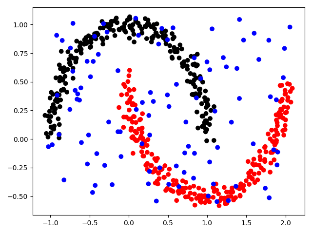

# Fast Density-Based Clustering Validation (DBCV)

Fast Density-Based Clustering Validation (DBCV) implementation for Python, with support for parallel and dynamically-adjustable high precision computation.

Fully compatible with the original MATLAB implementation available in [https://github.com/pajaskowiak/dbcv/](https://github.com/pajaskowiak/dbcv/).

*NOTE:* See below for instructions on how to ensure equivalent results to the MATLAB implementation if strictly required in your application.


---

## Table of contents
1. [Install](#install)
2. [Usage](#usage)
    1. [Basic usage](#basic-usage)
    2. [Example with noise "cluster"](#example-with-noise-cluster)
    3. [Multiprocessing](#multiprocessing)
    4. [High precision computation](#high-precision-computation)
    5. [Ensuring equivalent results with the original MATLAB implementation](#ensuring-equivalent-results-with-the-original-matlab-implementation)
3. [Reference](#reference)


---

## Install
```bash
python -m pip install "git+https://github.com/FelSiq/DBCV"
```

---

## Usage

### Basic usage

<table>
<tr>
<td>

</td>
<td>

```python
import dbcv
import sklearn.datasets

X, y = sklearn.datasets.make_moons(n_samples=300, noise=0.05, random_state=1782)

score = dbcv.dbcv(X, y)
print(score)
# 0.8545358723390613
```

</td>
</tr>
</table>

### Example with noise "cluster"

The DBCV metric naturally supports clustering configurations where some instances have not been clustered and are considered noise. By default, all instances with the cluster ID of -1 are considered noise (you can replace this ID with a custom value), as demonstrated in the example below.

<table>
<tr>
<td>

</td>
<td>

```python
import sklearn.datasets
import numpy as np
import dbcv

X, y = sklearn.datasets.make_moons(n_samples=500, noise=0.05, random_state=1782)

noise_id = -1  # NOTE: dbcv.dbcv(..., noise_id=-1) by default.

rng = np.random.RandomState(1082)
X_noise = rng.uniform(*np.quantile(X, (0, 1), axis=0), size=(100, 2))
y_noise = 100 * [noise_id]

X, y = np.vstack((X, X_noise)), np.hstack((y, y_noise))

score = dbcv.dbcv(X, y, noise_id=noise_id)
print(score)
# 0.7545431212217051
```

</td>
</tr>
</table>

### Multiprocessing

You can use the `dbcv.dbcv(..., n_processes=n)` argument to specify the number of parallel processes during computations. The default value of `n_processes` is `"auto"`, which is equivalent to 1 for datasets with 200 or fewer instances, and 4 for datasets with more than 200 instances.

```python
import dbcv
import sklearn.datasets

X, y = sklearn.datasets.make_moons(n_samples=300, noise=0.05, random_state=1782)

score = dbcv.dbcv(X, y, n_processes=2)
print(score)
# 0.8545358723390613
```

### High precision computation

If you are facing underflow issues and need more precision bits, you can dynamically adjust how many are available by enabling `dbcv.dbcv(..., enable_dynamic_precision=True)`. The number of precision bits available is controlled by `dbcv.dbcv(..., enable_dynamic_precision=True, bits_of_precision=n)`.

```python
import dbcv
import sklearn.datasets

X, y = sklearn.datasets.make_moons(n_samples=300, noise=0.05, random_state=1782)

score = dbcv.dbcv(X, y, enable_dynamic_precision=True, bits_of_precision=512)
print(score)
# 0.8545358723390613
```

Note that enabling this option makes the DBCV calculation much slower than the plain numpy/scipy version. However, this option may be necessary for computing DBCV in high dimensions, since density calculations easily underflow under that circumstance. The table below displays runtimes from computing DBCV on an dataset of shape (10,000, 784) twenty times in a row for variable amount of precision bits and for dynamic precision disabled.

Bits           | Runtime mean ± std (slowdown w.r.t. 'Off') |
:--            | :--                             |
Off (64 bits)  | 8.7808 ± 0.0475                 |
64             | 42.8156 ± 0.2801 (**+3.88x**)   |
128            | 45.3012 ± 0.0959 (**+4.16x**)   |
256            | 49.8338 ± 0.2369 (**+4.68x**)   |
512            | 58.2917 ± 0.1223 (**+5.64x**)   |
1024           | 80.1517 ± 0.2222 (**+8.13x**)   |

### Ensuring equivalent results with the original MATLAB implementation

This package is designed to be fully compatible with the original MATLAB implementation (see references for URL). However, a few convenient changes have been made to the default setup:

1. **The default noise cluster ID (label) is -1 instead of 0 in the MATLAB implementation.** This change was made to ensure easier compatibility with popular packages like [scikit-learn](https://github.com/scikit-learn/scikit-learn), which adopts the convention of labeling noise instances as -1. You can adjust the noise cluster ID using the argument `dbcv(..., noise_id=0)`.
2. **The default Minimum Spanning Tree (MST) algorithm used is Scipy's Kruskal's MST implementation.** The original MATLAB implementation uses a **variant** of Prim's MST algorithm. This package also provides a direct translation to Python of the MATLAB implementation. If you require strictly equivalent results to the original implementation, you can change the MST algorithm by setting `dbcv(..., use_original_mst_implementation=True)`. Note that the original implementation is expected to be slower than Scipy's implementation and tends to generate hub nodes more frequently (i.e., resulting trees are not equivalent).

Similar to the original MATLAB implementation, this package uses the squared Euclidean distance as the default distance metric. You can modify the metric by using `dbcv(..., metric="metric_name")`. All metrics implemented in Scipy are supported.

The following execution should be equivalent to the original source code execution:
```python
import dbcv
X, y = ...
score = dbcv.dbcv(X, y, metric="sqeuclidean", noise_id=0, use_original_mst_implementation=True)
```

For reference, the Table below exhibits a comparison between the results estimated by this Python implementation (using both MST algorithm implementations) and the original MATLAB code. The datasets are available in the [MATLAB GitHub repository](https://github.com/pajaskowiak/dbcv/tree/main/data).

Dataset | Python (Scipy's Kruskal's) | Python (Translated MST algorithm) | MATLAB |
:-- | --: | --: | --:
`dataset_1.txt` | 0.8566 | 0.8576 | 0.8576 |
`dataset_2.txt` | 0.5405 | 0.8103 | 0.8103 |
`dataset_3.txt` | 0.6308 | 0.6319 | 0.6319 |
`dataset_4.txt` | 0.8456 | 0.8688 | 0.8688 |

---

## Reference
1. Moulavi, Davoud & Andretta Jaskowiak, Pablo & Campello, Ricardo & Zimek, Arthur & Sander, Joerg. (2014). Density-Based Clustering Validation. 10.1137/1.9781611973440.96.
2. [https://github.com/pajaskowiak/dbcv/](https://github.com/pajaskowiak/dbcv/)
